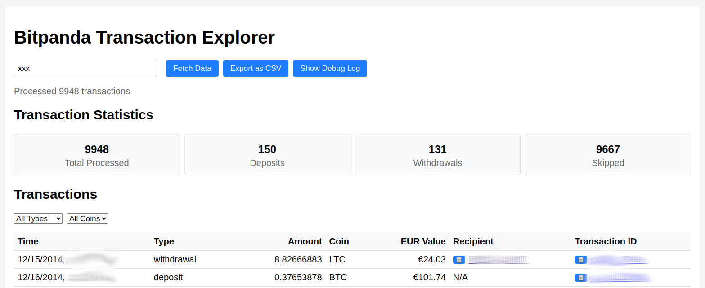

# Bitpanda Transaction Explorer

A local proxy server and web application for exploring your Bitpanda transactions with enhanced filtering and export capabilities.




## Features

- 🔄 Transaction fetching from Bitpanda API
- 🔍 Transaction filtering
- 📊 Transaction statistics
- 💾 CSV Export functionality for transaction data

## Prerequisites

- Python 3.11 or higher
- Poetry (Python package manager)

## Installation

1. Clone the repository
2. Install dependencies using Poetry:
   ```bash
   poetry install
   ```
3. Run the application:
   ```bash
   poetry run python proxy-server.py
   ```
4. Open `bitpanda-webapp.html` in your browser.
5. Create a new API key (https://web.bitpanda.com/my-account/apikey) in Bitpanda with the `Transaction` and `Balance` permissions. Paste the API key into the input field.
6. Click "Fetch Transactions" to load your transactions.

## Security

Your data and API key remain secure as everything runs locally on your machine. The API key is only used in your browser to communicate directly with Bitpanda's servers - it never needs to be stored anywhere and no third parties are involved.


## Acknowledgments

Built about 90% of the code with Claude 3.5 Sonnet.